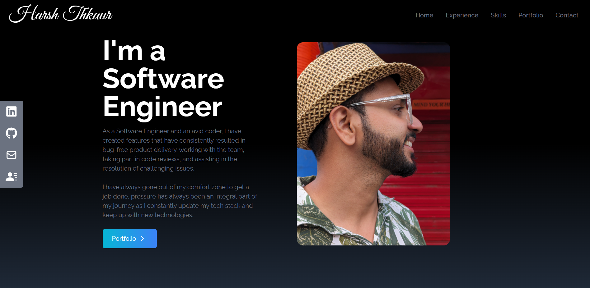

# Harsh Thakur — Portfolio

Personal portfolio site for Harsh Thakur, Senior Software Engineer.



## Stack

- **React 18** (Create React App)
- **Tailwind CSS 3.4** with a CSS-variable design-token system
- **react-icons** (Feather set) and **devicon** for the tech marquee
- No animation library — scroll reveals use a small `IntersectionObserver` hook

## Structure

```
src/
├── data/content.js      # Single source of truth for all site content
├── hooks/
│   ├── useReveal.js         # Scroll-triggered entrance animations
│   ├── useActiveSection.js  # Navbar active-link tracking
│   ├── useTheme.js          # Dark/light theme with localStorage
│   └── useScrollProgress.js # Top progress bar
└── components/
    ├── ui/               # Reveal, SectionHeading, Background, ScrollProgress
    └── ...               # NavBar, Home, About, Experience, Skills,
                          # Portfolio, Education, Contact, SocialLinks, Footer
```

### Theming

Colors live as raw RGB triplets in CSS custom properties (`src/index.css`) and are
mapped into Tailwind (`tailwind.config.js`) as `rgb(var(--token) / <alpha-value>)`,
so every utility supports opacity modifiers and both themes share one set of classes.
The theme is applied to `<html data-theme>` before first paint by an inline script in
`public/index.html` to avoid a flash of the wrong theme.

Updating content generally means editing `src/data/content.js` only.

## Scripts

```bash
npm start     # dev server at http://localhost:3000
npm run build # production build into ./build
```

## Deployment

Netlify — SPA rewrites are configured in `netlify.toml` and `_redirects`.
The `build/` directory is committed to the repo.
